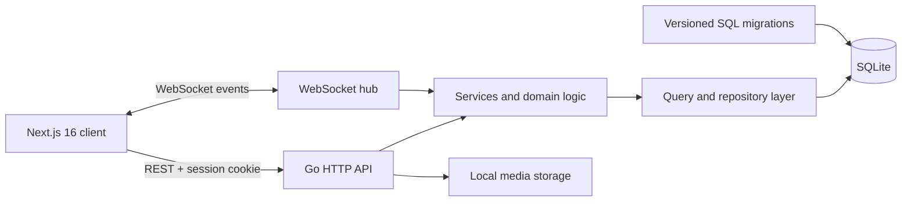

# Loop 2.0

> A full-stack social platform for sharing moments, building communities, and having real-time conversations.

Loop is a portfolio-scale social network built with **Next.js 16**, **React 19**, **Go**, **SQLite**, and **WebSockets**. It supports the complete journey from account creation and privacy controls to personalized feeds, group communities, event RSVPs, notifications, and direct messaging.

The current interface is the second-generation product experience: a responsive design system with an editorial visual language, accessible interaction states, and consistent layouts across all 16 routes.

## Product highlights

- **Authentication and sessions** — registration, login, logout, protected routes, HTTP-only session cookies, and session expiry.
- **Profiles and privacy** — avatars, biographies, public/private accounts, follower and following lists, and privacy controls.
- **Social graph** — discover users, follow public accounts, send requests to private accounts, accept or reject requests, and view mutual friends.
- **Content feed** — create, edit, and delete posts; attach media; control visibility; and add text or image comments.
- **Real-time messaging** — direct and group conversations over WebSockets with HTTP fallback and media uploads.
- **Communities** — create groups, discover communities, invite members, request access, and manage membership.
- **Group engagement** — group posts, threaded comments, events, custom RSVP options, and attendance counts.
- **Notifications** — real-time follow, invitation, membership, and event updates with unread state.
- **Responsive Loop 2.0 UI** — desktop and mobile navigation, shared design tokens, loading/empty states, modals, keyboard focus states, and reduced-motion support.

## Preview


## Architecture



The backend follows a layered structure:

- `routes` handles HTTP transport and request validation.
- `services` coordinates application and real-time behavior.
- `query` and repository files isolate database access.
- `models` defines the shared domain types.
- `migrations` creates and evolves the SQLite schema.
- `websocket` distributes direct messages, group updates, and notifications.

## Technology stack

| Layer | Technologies |
| --- | --- |
| Frontend | Next.js 16 App Router, React 19, TypeScript, CSS Modules, Tailwind CSS |
| Backend | Go 1.23, `net/http`, Gorilla WebSocket |
| Data | SQLite, `golang-migrate`, versioned SQL migrations |
| Security | bcrypt password hashing, UUID session tokens, HTTP-only cookies, CORS middleware |
| Delivery | Multi-stage Docker builds, Docker Compose |
| Quality | ESLint, TypeScript compiler, `gofmt`, Go tests, npm audit |

## Repository structure

```text
social-market/
├── backend/
│   ├── pkg/
│   │   ├── auth/          # Authentication, sessions, and CORS
│   │   ├── db/            # SQLite connection, migrations, and queries
│   │   ├── models/        # Domain models
│   │   ├── routes/        # HTTP and WebSocket handlers
│   │   ├── services/      # Application logic
│   │   └── websocket/     # Real-time message types
│   ├── uploads/           # Runtime media (ignored by Git)
│   └── server.go          # API entry point
├── frontend/
│   ├── app/               # App Router pages and route-level styles
│   ├── components/        # Shared UI components
│   └── utils/             # Session helpers
├── data/                  # Runtime database volume (ignored by Git)
└── docker-compose.yml
```

## Run with Docker

Docker is the fastest way to run the complete application.

```bash
git clone https://github.com/ihamzaihsan/social-market.git
cd social-market
docker compose up --build
```

Then open [http://localhost:3000](http://localhost:3000). The API runs at [http://localhost:8080](http://localhost:8080). SQLite migrations run automatically when the backend starts.

To stop the stack:

```bash
docker compose down
```

## Local development

### Prerequisites

- Node.js 20.9 or newer
- npm 10 or newer
- Go 1.23 or newer
- A C compiler supported by `go-sqlite3` (GCC on Windows/Linux or Xcode command-line tools on macOS)

### 1. Start the backend

```bash
cd backend
cp .env.example .env
go mod download
go run server.go
```

The environment file is optional. Supported values are:

| Variable | Default | Purpose |
| --- | --- | --- |
| `DB_PATH` | `./social-network.db` | SQLite database location |
| `PORT` | `8080` | Backend HTTP port |

### 2. Start the frontend

In another terminal:

```bash
cd frontend
npm ci
npm run dev
```

Open [http://localhost:3000](http://localhost:3000). During local development the frontend expects the API at `http://localhost:8080`.

## Quality checks

Frontend:

```bash
cd frontend
npm run lint
npm run typecheck
npm run build
npm audit
```

Backend:

```bash
cd backend
gofmt -w .
go test ./...
go vet ./...
```

## Database lifecycle

The application creates a fresh SQLite database automatically and applies migrations from `backend/pkg/db/migrations/sqlite`. Database files, uploaded media, local environment files, and compiled binaries are intentionally excluded from version control so the repository contains no personal runtime data.

## Engineering decisions

- **SQLite** keeps local setup lightweight while preserving relational modeling, foreign keys, and repeatable migrations.
- **Go's standard HTTP server** keeps the API explicit and dependency-light.
- **WebSockets with HTTP fallback** provide responsive messaging while retaining a reliable delivery path.
- **Server-managed sessions** allow revocation and single-session behavior without exposing session state to client JavaScript.
- **A shared CSS design layer** modernizes the product without coupling visual changes to backend behavior.

## Roadmap

- Add automated integration and browser tests.
- Centralize frontend API configuration for multi-environment deployments.
- Move media storage to an object-storage provider for production scale.
- Add pagination and caching for larger feeds and conversations.
- Expand accessibility testing with automated and manual audits.

## Author

**Hamza Cheema** — Full-stack development, product design, and the Loop 2.0 frontend redesign.

If this project helped you evaluate my work, I would be happy to walk through the architecture and engineering decisions in an interview.
