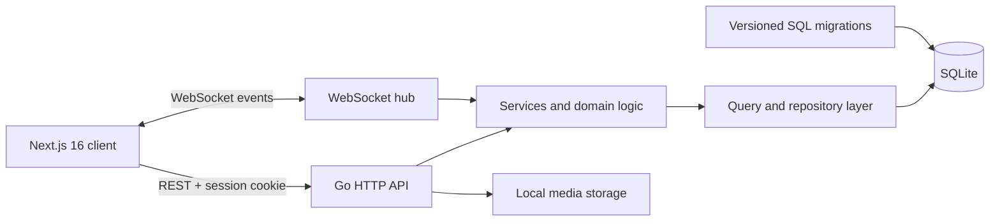

# Loop 2.0

> A full-stack social platform for sharing moments, building communities, and having real-time conversations.

Loop is a portfolio-scale social network built with **Next.js 16**, **React 19**, **Go**, **SQLite**, and **WebSockets**. It supports the complete journey from account creation and privacy controls to personalized feeds, group communities, event RSVPs, notifications, and direct messaging.

The current interface is the second-generation product experience: a responsive design system with an editorial visual language, accessible interaction states, and consistent layouts across authentication, social, and account pages.

## Product highlights

- **Google authentication** ? register and sign in through Google OAuth when configured; connect Google to an existing account from Settings, with a required profile completion step for new accounts.
- **Authentication and sessions** — registration, login, logout, protected routes, HTTP-only session cookies, and session expiry.
- **Profiles and privacy** — avatars, biographies, public/private accounts, follower and following lists, and privacy controls.
- **Social graph** — discover users, follow public accounts, send requests to private accounts, accept or reject requests, and view mutual friends.
- **Content feed** — create, edit, and delete posts; attach media; control visibility; and add text or image comments.
- **Real-time messaging** — direct and group conversations over WebSockets with HTTP fallback and media uploads.
- **Communities** — create groups, discover communities, invite members, request access, and manage membership.
- **Group engagement** — group posts, threaded comments, events, custom RSVP options, and attendance counts.
- **Notifications** — real-time follow, invitation, membership, and event updates with unread state.
- **Responsive Loop 2.0 UI** — desktop and mobile navigation, shared design tokens, loading/empty states, modals, keyboard focus states, and reduced-motion support.

## Preview


## Architecture



The backend follows a layered structure:

- `routes` handles HTTP transport and request validation.
- `services` coordinates application and real-time behavior.
- `query` and repository files isolate database access.
- `models` defines the shared domain types.
- `migrations` creates and evolves the SQLite schema.
- `websocket` distributes direct messages, group updates, and notifications.

## Technology stack

| Layer | Technologies |
| --- | --- |
| Frontend | Next.js 16 App Router, React 19, TypeScript, CSS Modules, Tailwind CSS |
| Backend | Go 1.23, `net/http`, Gorilla WebSocket |
| Data | SQLite, `golang-migrate`, versioned SQL migrations |
| Security | TLS 1.2/1.3, bcrypt password hashing, atomic UUID sessions, Secure/HttpOnly cookies, origin checks, HTTP/WebSocket rate limits |
| Delivery | Multi-stage Docker builds, Docker Compose |
| Quality | ESLint, TypeScript compiler, `gofmt`, Go tests, npm audit |

## Repository structure

```text
loop-2.0-social-network/
├── backend/
│   ├── pkg/
│   │   ├── auth/          # Authentication, sessions, and CORS
│   │   ├── db/            # SQLite connection, migrations, and queries
│   │   ├── models/        # Domain models
│   │   ├── routes/        # HTTP and WebSocket handlers
│   │   ├── services/      # Application logic
│   │   └── websocket/     # Real-time message types
│   ├── uploads/           # Runtime media (ignored by Git)
│   └── server.go          # API entry point
├── frontend/
│   ├── app/               # App Router pages and route-level styles
│   ├── components/        # Shared UI components
│   └── utils/             # Session helpers
├── data/                  # Runtime database volume (ignored by Git)
└── docker-compose.yml
```

## Run with Docker

Docker is the fastest way to run the complete application.

Start Docker Desktop (Windows) or the Docker daemon (Linux). The single launcher, `start-docker.cmd`, runs as a Windows batch file or a POSIX shell script. Only **Docker with the Compose plugin** is required; no Python or additional runtime is needed.

| Action | Windows | Linux / macOS |
| --- | --- | --- |
| Build and start | `.\start-docker.cmd` (or double-click) | `sh start-docker.cmd` |
| Start existing images | `.\start-docker.cmd --no-build` | `sh start-docker.cmd --no-build` |

On Linux, `sh start-docker.cmd` does not require executable permission. To run the file directly from a shell such as Bash, grant executable permission once:

```bash
chmod a+x ./start-docker.cmd
./start-docker.cmd            # Build and start
./start-docker.cmd --no-build # Start existing images
```

The combined script has no shebang, so direct execution depends on the calling shell's fallback behavior. Use `sh start-docker.cmd` for reliable execution across shells. Windows does not require `chmod`.

The launcher starts containers in the background and uses Compose's `--wait` to confirm they are running. This checks container status; the services do not define HTTP health checks. It resolves the project directory from its own location, so it works from other directories when invoked by its full path. Start-only mode does not build or pull images and works when containers are already running. Rebuild after changing code. The Windows console closes when a double-clicked run finishes; run it from a terminal to keep the output visible.

The launcher uses [http://localhost:3000](http://localhost:3000) for the app and [http://localhost:8081](http://localhost:8081) for the API to avoid port 8080 conflicts. For other API ports, use Compose directly with the `API_PORT` environment variable set to the desired port for both build and subsequent startup commands.

The frontend Docker build accepts `API_PORT` and an optional `NEXT_PUBLIC_API_URL` argument. All requests, media and WebSocket connections use the shared API configuration; changing it requires a rebuild. The HTTP launcher is for local development. Use the HTTPS setup below for encrypted connections. The launcher leaves containers running until you stop them with `docker compose down`.

For the standard ports (frontend 3000, API 8080), use Compose directly:

```bash
git clone https://github.com/ihamzaihsan/loop-2.0-social-network.git
cd loop-2.0-social-network
docker compose up --build
```

Then open [http://localhost:3000](http://localhost:3000). The API runs at [http://localhost:8080](http://localhost:8080). SQLite migrations run automatically when the backend starts.

To stop the stack:

```bash
docker compose down
```

## HTTPS and security

Use Docker Compose 2.24.4 or newer for the HTTPS override. Generate your own development certificate once from the repository root; this utility requires Go and refuses to overwrite an existing certificate/key:

```bash
go run scripts/generate-cert.go
# Stop the HTTP stack before switching its network configuration.
docker compose down
docker compose -f docker-compose.yml -f docker-compose.https.yml up -d --build
```

Open [https://localhost:8443](https://localhost:8443). [http://localhost:8088](http://localhost:8088) redirects to HTTPS. The API is `/api` on the same origin; WebSockets use `wss://localhost:8443/api/ws`. Backend and frontend ports are private to Docker in this configuration. SQLite and uploads retain the same mounted directories across rebuilds. To stop this configuration, use `docker compose -f docker-compose.yml -f docker-compose.https.yml down`.

The generated ECDSA P-256 certificate covers `localhost`, `127.0.0.1` and `::1` and expires after one year. It is self-signed, so browsers show a trust warning until you explicitly trust `certs/localhost.crt` locally. On Windows, open the certificate, choose **Install Certificate**, select **Current User**, and install this locally generated certificate into **Trusted Root Certification Authorities**; restart your browser if needed. Only trust your own development certificate. The private key stays in the ignored `certs/` directory and is mounted read-only into Nginx; it must never be published. Unix file permissions restrict the key to its owner; use Windows file ACLs when sharing a Windows machine.

Nginx accepts TLS 1.2 and 1.3. TLS 1.2 uses ECDHE with AES-GCM or ChaCha20-Poly1305; TLS 1.3 uses OpenSSL's modern AEAD defaults. Older TLS protocols and session tickets are disabled. See [Nginx's HTTPS documentation](https://nginx.org/en/docs/http/configuring_https_servers.html).

For a public deployment, replace the localhost certificate and key with a CA-issued certificate, configure your domain and port 443 in `deploy/nginx.conf`, update `FRONTEND_URL` and Google's redirect URI, and rebuild the frontend with `/api`. If the CA uses an RSA key, also add the corresponding ECDHE-RSA AEAD cipher suites. Enable HSTS after verifying the public HTTPS domain; the localhost configuration deliberately omits HSTS because browsers apply it across localhost ports. The dedicated Docker subnet is `172.29.247.0/24`; if it conflicts with your network, change both the subnet and `TRUSTED_PROXY_CIDRS` together. Never trust forwarded client addresses from publicly accessible peers.

Implemented protections:

- Passwords are salted bcrypt hashes at cost 10; they are not stored as plaintext or reversible encryption. Google-only accounts have no local password until the user creates one. See [OWASP password storage guidance](https://cheatsheetseries.owasp.org/cheatsheets/Password_Storage_Cheat_Sheet.html).
- Sessions use random UUIDv4 identifiers in server-side SQLite records. A transaction and a unique database index enforce one active session per account, even during concurrent logins. Each request rechecks database expiry, revocation and suspension. Login rotates the identifier; logout, password reset and account suspension revoke sessions.
- HTTPS session cookies have `Secure`, `HttpOnly`, `SameSite=Lax`, path `/`, and a 24-hour lifetime. Session identifiers are excluded from JSON responses and browser local storage. Origin checks and Fetch Metadata reject untrusted cross-site requests, including WebSocket handshakes.
- API rate limiting allows 300 requests/minute per client address with a burst of 100. Login, registration and Google authentication additionally share 10 requests/minute with a burst of 10; Google configuration reads use the general limit. Password recovery retains its separate five-attempt/15-minute limit. API rejection returns HTTP 429 with `Retry-After`. Only configured trusted proxies can supply `X-Real-IP`.
- WebSocket messages share a per-account limit of 120/minute with a burst of 30 across tabs; excessive traffic closes the offending connection with code 1008. Nginx additionally limits dynamic page/API requests to 30/second with a burst of 100. Application limiter maps are bounded and expire idle entries; they are process-local, appropriate to the single-backend deployment. Multiple backend replicas would need a shared rate-limit store.
- Requests are capped at 10 MiB, with header/body/idle timeouts and security response headers. SQLite uses parameterized queries and foreign-key constraints. The database file itself is not encrypted; database encryption remains an optional extension.

Verification used an isolated database and Docker network. It covered 2,000 concurrent limiter checks, 40 concurrent session rotations, forged/expired/revoked/suspended sessions, a 30-request concurrent login burst (10 authentication failures and 20 HTTP 429 responses), forwarded-IP spoofing, cross-origin mutations, WebSocket flooding, TLS version negotiation, and HTTPS post/comment/media flows with mobile pages in both themes. Go race checks, `go vet`, TypeScript, ESLint and production Docker builds passed. Temporary audit code and fixtures were removed after verification. These checks cover the implemented protections rather than constituting an independent penetration test.

For Google authentication over this HTTPS setup, add `https://localhost:8443/api/auth/google/callback` to the Google web client's authorized redirect URIs. The override supplies this callback and the frontend origin; your private client ID/secret still come from `backend/.env`.

## Google registration and sign-in

Google authentication requires credentials from your own Google Cloud project. Until configured, the Google buttons show that sign-in is unavailable; email/password authentication continues to work.

1. Open [Google Auth Platform](https://console.cloud.google.com/auth/overview) in a Google Cloud project. Configure Branding and Audience for your application. If the app is in Testing, add the Google accounts that will test it as test users.
2. In **Clients**, create an OAuth client of type **Web application**. Add `http://localhost:8081/auth/google/callback` to its **Authorized redirect URIs** when using `start-docker.cmd`. For standard Compose on API port 8080, use `http://localhost:8080/auth/google/callback` instead. The URI must match exactly.
3. Copy the client ID and client secret into the ignored `backend/.env` file:

   ```dotenv
   FRONTEND_URL=http://localhost:3000
   GOOGLE_CLIENT_ID=your-web-client-id.apps.googleusercontent.com
   GOOGLE_CLIENT_SECRET=your-client-secret
   GOOGLE_REDIRECT_URI=http://localhost:8081/auth/google/callback
   ```

4. Run `start-docker.cmd` again to recreate the backend with the new environment. Compose reads `backend/.env`; direct Go runs require exporting these variables in the shell, as `.env` files are not loaded automatically.
5. Select **Continue with Google** on either Login or Register. New users finish their name/date-of-birth profile and receive a private account. Returning users sign in immediately. Existing email/password users sign in normally first and select **Connect Google** in Settings.

The backend uses Google's authorization-code flow, S256 PKCE, a browser-bound one-use state cookie, and Google UserInfo over HTTPS. Identity links use Google's stable `sub`, never just email. Provider access tokens and secrets stay on the server; provider tokens are not retained. Sign-in uses Loop's existing HTTP-only session cookie and single active session policy. In production, use HTTPS and the same site for frontend/API cookies; HTTPS frontend configuration enables secure session cookies. Google-only users can confirm with Google again before changing their email, setting an optional password, or deleting their account; this confirmation lasts ten minutes.

Local verification covered the backend sign-in and account-management paths with simulated Google responses, plus browser form/navigation checks in both themes. A live Google consent flow still requires your configured OAuth credentials.

See [Google's web-server OAuth guide](https://developers.google.com/identity/protocols/oauth2/web-server) for credential setup and deployment requirements.

## Local development

### Prerequisites

- Node.js 20.9 or newer
- npm 10 or newer
- Go 1.23 or newer
- A C compiler supported by `go-sqlite3` (GCC on Windows/Linux or Xcode command-line tools on macOS)

### 1. Start the backend

```bash
cd backend
cp .env.example .env
go mod download
go run server.go
```

The environment file is optional. Supported values are:

| Variable | Default | Purpose |
| --- | --- | --- |
| `DB_PATH` | `./social-network.db` | SQLite database location |
| `PORT` | `8080` | Backend HTTP port |

### 2. Start the frontend

In another terminal:

```bash
cd frontend
npm ci
npm run dev
```

Open [http://localhost:3000](http://localhost:3000). During local development the frontend expects the API at `http://localhost:8080`.

## Quality checks

Frontend:

```bash
cd frontend
npm run lint
npm run typecheck
npm run build
npm audit
```

Backend:

```bash
cd backend
gofmt -w .
go test ./...
go vet ./...
```

## Database lifecycle

The application creates a fresh SQLite database automatically and applies migrations from `backend/pkg/db/migrations/sqlite`. Database files, uploaded media, local environment files, and compiled binaries are intentionally excluded from version control so the repository contains no personal runtime data.

## Engineering decisions

- **SQLite** keeps local setup lightweight while preserving relational modeling, foreign keys, and repeatable migrations.
- **Go's standard HTTP server** keeps the API explicit and dependency-light.
- **WebSockets with HTTP fallback** provide responsive messaging while retaining a reliable delivery path.
- **Server-managed sessions** allow revocation and single-session behavior without exposing session state to client JavaScript.
- **A shared CSS design layer** modernizes the product without coupling visual changes to backend behavior.

## Roadmap

- Add automated integration and browser tests.
- Centralize frontend API configuration for multi-environment deployments.
- Move media storage to an object-storage provider for production scale.
- Extend pagination and caching to larger conversations.
- Expand accessibility testing with automated and manual audits.

## Author

**Hamza Cheema** — Full-stack development, product design, and the Loop 2.0 frontend redesign.

If this project helped you evaluate my work, I would be happy to walk through the architecture and engineering decisions in an interview.
