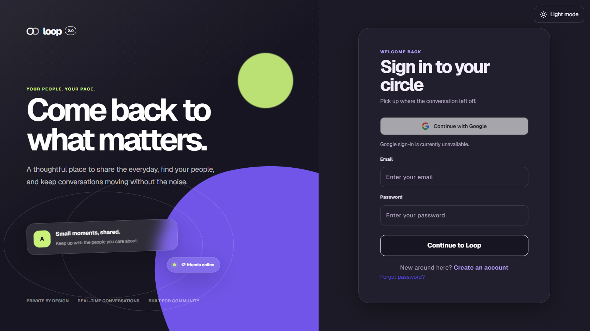

# Loop 2.0 | Full-Stack Social Network

A social network for sharing posts, building communities, and chatting in real time. My main portfolio project, demonstrating full-stack development across a responsive frontend, a Go API, relational databases, and real-time communication.

**[Live demo](https://loop-20-ihamzaihsan.vercel.app)** · **[GitHub](https://github.com/ihamzaihsan/loop-2.0-social-network)**



## Features

- **Accounts and privacy:** Email/password authentication, public and private profiles, follow requests, and account settings. Google sign-in is available when configured.
- **Posts and discovery:** Create, edit, and delete posts; share images; like and comment; search users, posts, and groups.
- **Real-time communication:** Direct and group messaging, image sharing, notifications, and unread indicators.
- **Communities:** Group creation, invitations, membership requests, group posts, and events with RSVP options.
- **Safety:** User blocking, content reporting, and moderator controls.
- **Responsive interface:** Desktop and mobile layouts with light and dark themes.

## Tech stack

| Area | Technologies |
| --- | --- |
| Frontend | Next.js 16, React 19, TypeScript, Tailwind CSS, CSS Modules |
| Backend | Go, standard-library HTTP server, Gorilla WebSocket |
| Database | SQLite, relational data modeling, SQL migrations |
| Development and deployment | Docker, Docker Compose, Nginx for local HTTPS |

## Engineering highlights

- **API organization:** HTTP handlers, application services, and database queries are separated to keep responsibilities clear.
- **Access control:** The backend checks permissions for private profiles, posts, groups, and uploaded media.
- **Authentication:** bcrypt password hashing and server-managed sessions with HTTP-only cookies support session expiry and revocation.
- **Real-time delivery:** WebSocket messaging includes an HTTP fallback; shared frontend helpers handle API requests, media URLs, and connection URLs.
- **Persistent data:** SQLite keeps local setup simple, with relational constraints and versioned migrations to initialize the database.

## Run locally

Install Docker with the Compose plugin, then run:

```bash
git clone https://github.com/ihamzaihsan/loop-2.0-social-network.git
cd loop-2.0-social-network
docker compose up --build
```

Open **[http://localhost:3000](http://localhost:3000)**. The API runs at `http://localhost:8080`. Database migrations run automatically; Docker mounts keep the local database and uploaded media across container rebuilds.

Create an account to explore the app. Use a second account to try follow requests, messaging, and group invitations.

Stop the application with:

```bash
docker compose down
```

Email/password registration works without external credentials. For Google sign-in or password recovery emails, copy `backend/.env.example` to `backend/.env` and configure the relevant Google OAuth or SMTP values. For this setup, set `GOOGLE_REDIRECT_URI` to `http://localhost:8080/auth/google/callback` and register that exact URI with Google. Docker Compose reads the environment file; restart the backend after changing it. Keep credentials out of Git.

## Project structure

```text
frontend/     Next.js pages, reusable components, and API helpers
backend/      Go API, authentication, services, queries, and migrations
deploy/       Nginx configuration for the optional HTTPS setup
scripts/      Local development certificate generator
docs/         Project preview
```

## Development checks

Frontend, from `frontend/`:

```bash
npm ci
npm run lint
npm run typecheck
npm run build
```

Backend, from `backend/` (requires the Go version in `go.mod` and a C compiler for SQLite):

```bash
go test ./...
go vet ./...
```

These commands check linting, types, compilation, and Go packages. Automated browser and integration coverage remains a future improvement; Google sign-in and email delivery require configured external services.

## Author

**Hamza Cheema** · [GitHub](https://github.com/ihamzaihsan)
